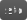

# OSL metadata standardisation proposal

Draft 1

## Table of contents

1. [Motivation](#motivation)
1. [Support Levels](#support-levels)
1. [Common Keywords](#common-keywords)
1. [page](#page-std)
1. [widget](#widget-std)
   1. [number](#widget-number-std)
   1. [string](#widget-string-std)
   1. [checkBox](#widget-checkbox-std)
   1. [color](#widget-color-std)
   1. [popup](#widget-popup-std)
   1. [mapper](#widget-mapper-std)
   1. [fileInput](#widget-fileinput-new)
   1. [colorRamp](#widget-colorramp-new)
   1. [floatRamp](#widget-floatramp-new)
1. [Arrays](#arrays-new)
1. [Conditional visibility or locking](#conditional-visibility-or-locking-new)
1. [DCC app integration](#dcc-app-integration-new)

## Motivation

User interfaces are important for usability and enforcing conventions across DCCs goes a long way towards makintg artists' work easier.

Currently, OSL defines only a few metadata keywords, representing a subset of Katana's UI capabilities. Then, there are all the other DCCs like Houdini, Maya, Cinema4D, Blender, etc, which support either none, a subset or an entirely different set of UI metadata keywords.

This area is ripe for standardization and having implemented many of these keywords in RenderMan for Maya, I am confident this would greatly improve user experience at a reasonnable cost.

The emphasis of this proposal is to define a somewhat minimal set of UI hints that may be supported by most DCC applications.

## Support levels

Given the number of controls to implement, it may be useful to introduce support levels.
*  : Only support a small number of randomly chosen keywords.
*  : Support a minimal standard set of keywords.
*  : Support most if not all keywords.

<!-- badge generation -->
<!--  -->
<!--  -->
<!--  -->

One would hope that developers implements at least the basic level, as it would already provide a reasonnable user-experience.

As of today:

* RenderMan plugins are very close to full support.
* 3Delight supports a very good range of keywords.
* Arnold plugins mostly ignore parameter metadata as it historically relied on an external metadata file.
* Blender only supports 4 keywords.
* VRay TBD
* Redshift TBD
* Octane TBD

## Common keywords

These keywords are supported by all widgets.

| Keyword | Type | Description | |
| - | - | - | - |
| `label` | string | A user-friendly name used in the UI |  |
| `help` | string | A description of the parameter that may appear in the UI |  |
| `readOnly` | int | If non-zero, only connections will be considered. Defaults to 0. |  |
| `connectable` | int | Specifies if this parameter accepts an incoming connection. If not connectable, the host app should forbid connections. Default to 1.|  |
</br>

## `page` 

Assign the parameter to a page defined as a dot-separated path, i.e. "Specular.Advanced".

| Widget options | Type | Description | |
| - | - | - | - |
| `open` | int | If 1, the page UI is expanded by default |  |

##### Sample code

```c
color specularTint = 1
[[[
    string page = "Specular",
    string label = "Tint",
]]],
float specularIOR = 1.5
[[
    string page = "Specular",
    string label = "Index of Refraction",
    float min = 1.0
]]
int specularModel = 1
[[
    string page = "Specular",
    string label = "Model",
    string widget = "mapper",
    string options = "Beckmann:0|GGX:1"
]]
```
</br>

## `widget` 

Defines which widget type will control the parameter. All parameter types default to a sensible widget if un-defined in the metadata block.

### Widget: `null` 

Parameters using a `null` widget are invisible in the UI.

##### Sample code

```c
string asset_version = "2.3.0"
[[
    string widget = "null"
]],
```

### Widget: `number` 

A widget for editable numeric values. This is the default widget used for number parameters.

| Widget options | Type | Description | |
| - | - | - | - |
| `min` | float / int | An absolute minimum value for the parameter. |  |
| `max` | float / int | An absolute maximum value for the parameter. |  |
| `digits` | int | Number of digits displayed after the decimal point. |  |
| `slider` | int | If non-zero, display a slider to edit the value. |  |
| `slidermin` | float / int | Minimum value of the slider. |  |
| `slidermax` | float / int | Maximum value of the slider. |  |

##### Sample code

```c
float ior = 1.5
[[
    string widget = "number",
    float min = 0.0,
    float max = 2.5,
    int slider = 1,
    string help = "The Substrate's Index Of Refraction"
]],
```

### Widget: `string` 

Default widget type used for string parameters.

##### Sample code

```c
string variant = "default"
[[
    string widget = "string",
    string label = "Variant",
]],
```

### Widget: `checkBox` 

An int parameter displayed as a boolean check box.

##### Sample code

```c
int invert = 0
[[
    string widget = "checkBox",
    string label = "Invert Output"
]],
```

### Widget: `color` 

A widget used to edit color parameters.

| Widget options | Type | Description | |
| - | - | - | - |
| `color_enableFilmlookVis`[^1] | int | Enable color-managed UI. |  |
| `color_restrictComponents` | int | Limit components to [0:1] |  |

[^1]: This is a Katana-ism and I would prefer something more generic like `color_managed` that doesn't mention "film".

##### Sample code

```c
color albedo = "default"
[[
    string widget = "color",
    int color_enableFilmlookVis = 1,
    string label = "Albedo"
]],
```

### Widget: `popup` 

Display a pop-up menu or combox box with literal choices for a string parameter.

| Widget options | Type | Description | |
| - | - | - | - |
| `options` | string | A pipe-delimited list of menu items, i.e. `"One\|Two\|Three"` |  |
| `editable` | int | If non-zero, present an editable field with a side menu |  |

##### Sample code

```c
string sss_mode = "default"
[[
    string widget = "popup",
    string options = "burley|random walk"
]],
```

### Widget: `mapper` 

An menu presenting associative choices (like enums) for int, float and string parameters.

| Widget options | Type | Description | |
| - | - | - | - |
| `options` | string | A pipe-delimited list of menu items : value pairs, i.e. `"Add:0\|Over:1\|Multiply:2"` |  |

##### Sample code

```c
int compositingMode = 0
[[
    string widget = "mapper",
    string options = "Over:0|Add:1|Screen:3|Mult:2|Overlay:4",
    string label = "Compositing Mode"
]],
```

### Widget: `fileInput` 

A string attributes containing a file path. There should always be an associated button to open a file browser and select the file.

| Widget options | Type | Description | |
| - | - | - | - |
| `fileTypes` | string | A comma-delimited list of extensions, i.e. `"tex,tx,exr"`, to filter the dialog's file list. |  |
| `assetDialog` | int | Controls if an asset selection dialog should be prefered to a standard file browser. Defaults to 1 and fallback to a standard file dialog is not available.

##### Sample code

```c
string texture = ""
[[
    string widget = "fileInput",
    string label = "Texture"
]],
```

### Widget: `colorRamp` 

> [!NOTE]
> OSL's spline interpolation shadeops only work on static arrays when most users actually want dynamic arrays. This forces the shader writer to copy multiple dynamic arrays to static arrays. I don't know the exact cost of that operation but it would be great to get rid of this limitation.

> [!NOTE]
> Start and end knots need to be repeated n-times depending on the interpolation scheme. It would be nice to add an option flag to let the spline shadeop automatically select the correct number of repetitions.

> [!NOTE]
> It would be good to make sure DCC app widgets support all standard OSL interpolation modes. Last time I checked Maya did not.

Color ramps depend on multiple parameters to provide knots position, knots value and knots interpolation.

The main parameter is an int parameter with a `colorRamp` widget. Its value is the number of currently used knots. This representation allows support of fixed-size ramps.

The metadata MUST define 3 additional keywords (`rampKnots`, `rampColors` and `rampInterp`) to be functional. If any of theme is missing, an error should be raised.

> [!NOTE]
> Should we extend oslc to validate metadata ?

| Widget options | Type | Description | |
| - | - | - | - |
| `rampKnots` | string | Name of the parameter storing knot positions. |  |
| `rampColor` | string | Name of the parameter storing knot colors. |  |
| `rampInterp` | string | Name of the parameter storing interpolation bases. </br><ul><li>If that parameter is a string array, each span can have a different interpolation basis.</li><li>If that parameter is a string, all spans use the same interpolation basis.</li></ul> |  |
| `gradientHeight` | int | The height of the gradient widget in pixels. |  |

##### Sample code

```c
int colorMap = 4
[[
    string label = "Color Map",
    string widget = "colorRamp",
    string rampKnots = "colorMap_Knots",
    string rampColors = "colorMap_Colors",
    string rampInterp = "colorMap_Interpolation",
    int gradientHeight = 25,
]],
float colorMap_Knots[] = {0, 0,
                          1, 1}
[[
    int isDynamicArray = 1,
    string widget = "null",
]],
float colorMap_Knots[] = {color(0), color(0),
                          color(1), color(1)}
[[
    int isDynamicArray = 1,
    string widget = "null",
    int restrictComponents = 1
]],
float colorMap_Interpolation[] = {"catmull-rom", "catmull-rom",
                                  "catmull-rom", "catmull-rom"}
[[
    int isDynamicArray = 1,
    string widget = "null",
]],
```

### Widget: `floatRamp` 

The main parameter is an int parameter with a `colorRamp` widget.
* Its value is the number of currently used knots. This representation allows support of fixed-size ramps.

The metadata MUST define 3 additional keywords (`rampKnots`, `rampColors` and `rampInterp`) to be functional.
* If any of theme is missing, an error should be raised.

| Widget options | Type | Description |  |
| - | - | - | - |
| `rampKnots` | string | Name of the parameter storing knot positions. |  |
| `rampColor` | string | Name of the parameter storing knot colors. |  |
| `rampInterp` | string | Name of the parameter storing interpolation bases. </br><ul><li>If that parameter is a string array, each span can have a different interpolation basis.</li><li>If that parameter is a string, all spans use the same interpolation basis.</li></ul> |  |
| `gradientHeight` | int | The height of the gradient widget in pixels. |  |

##### Sample code

```c
int attenuationCurve = 5
[[
    string label = "Attenuation Curve",
    string widget = "floatRamp",
    string rampKnots = "attenCrv_Knots",
    string rampFloats = "attenCrv_Values",
    string rampInterp = "attenCrv_Interpolation",
    int gradientHeight = 25,
]],
float attenCrv_Knots[] = {0, 0, 0.5, 1, 1}
[[
    int isDynamicArray = 1,
    string widget = "null",
]],
float attenCrv_Values[] = {0, 0, 0.3333, 1, 1}
[[
    int isDynamicArray = 1,
    string widget = "null"
]],
float attenCrv_Interpolation[] = {"catmull-rom", "catmull-rom",
                                  "catmull-rom", "catmull-rom",
                                  "catmull-rom"}
[[
    int isDynamicArray = 1,
    string widget = "null",
]],
```
</br>

## Arrays 

OSL support array parameters of any types and the metadata allows writers to decide which widget should be used.

* **Dynamic arrays** allow the addition, re-ordering and removal of array elements.
* **UI Structs** are a way to display multiple arrays as if they were a single array of structs, which isn't natively supported by OSL, but useful to group, for example, layer parameters. If the arrays are dynamic, it will be the responsability of the DCC app to keep all participating arrays at the same size at all times.

| Array options | Type | Description | |
| - | - | - | - |
| `size` | int | **Static arrays**: the array size.</br>**Dynamic arrays**: the number of existing members on node creation. Defaults to <kbd>-1</kbd> for empty. | [new](img/new.svg) |
| `isDynamicArray` | int | Specifies if the array can be resized. | [new](img/new.svg) |
| `uiStruct` | string | Associate this array with a named struct-like UI where members of multiple arrays are displayed interlaced. | [new](img/new.svg) |
| `tupleSize` | int | Specifies the tuple size (column count). This is passed to the child widgets. | [new](img/new.svg) |
| `tupleGroupSize` | int | Specifies the number of tuples each child widget should handle. | [new](img/new.svg) |

##### Sample code

```c
int triplanarAxisEnable[3] = {1, 1, 1}
[[
    string label = "Enable Axis"
    string widget = "checkBox",
    int size = 3,
    string uiStruct = "Triplanar Axes",
]],
string triplanarAxisTexture[3] = {"", "", ""}
[[
    string label = "Texture"
    string widget = "fileInput",
    int size = 3,
    string uiStruct = "Triplanar Axes",
]],
float triplanarAxisRepeat[3] = {1.0, 1.0, 1.0}
[[
    string label = "Enable Axis",
    string widget = "number",
    int size = 3,
    string uiStruct = "Triplanar Axes",
    int slider = 1,
    float min = 0.0001,
    float slidermax = 10.0
]],
```

## Conditional visibility or locking 

These keywords allow to control a parameter's visibility or editability based on the value of one or more shader parameters. The comparison rules are defined as a set of pair-wise comparisons: <code><i>prefix</i>Path <i>prefix</i>Op <i>prefix</i>Value</code> or <code><i>prefix</i>Left <i>prefix</i>Op <i>prefix</i>Right</code>

> [!NOTE]
>Katana uses `conditionalVis` / `conditionalLock` but I prefer a shorter keyword as it is still descriptive enough. TBD.

> [!NOTE]
> Pages should also support conditional visibility and locking.
> How about `pageVis*` and `pageLock*` ?

The keyword structure is as follows:

1. The root token is `vis` or `lock`.
1. It is followed by an optional identifying suffix.
1. It ends with one of the following tokens: `Op`, `Path`, `Value`, `Left`, `Right`.

| Visibility | Type | Description | |
| - | - | - | - |
| `vis*Path` | string | Parameter path constituting the left side of the comparison. |  |
| `vis*Op` | string | Comparison method to show/hide this parameter |  |
| `vis*Value` | string | A value for the right side of the comparison. |  |

| Locking | Type | Description | |
| - | - | - | - |
| `lock*Path` | string | Parameter path constituting the left side of the comparison. |  |
| `lock*Op` | string | the comparison method to lock/inlock this parameter |  |
| `lock*Value` | string | A value for the right side of the comparison. |  |

| Comparisons | Description | |
| - | - | - |
| `equalTo` | <kbd><i>prefix</i>Path == <i>prefix</i>Value</kbd> |  |
| `notEqualTo` | <kbd><i>prefix</i>Path != <i>prefix</i>Value</kbd> |  |
| `greaterThan` | <kbd><i>prefix</i>Path > <i>prefix</i>Value</kbd> |  |
| `lessThan` | <kbd><i>prefix</i>Path < <i>prefix</i>Value</kbd> |  |
| `greaterThanOrEqualTo` | <kbd><i>prefix</i>Path >= <i>prefix</i>Value</kbd> |  |
| `lessThanOrEqualTo` | <kbd><i>prefix</i>Path <= <i>prefix</i>Value</kbd> |  |
| `and` | <kbd><i>prefix</i>Left <= <i>prefix</i>Right</kbd> |  |
| `or` | <kbd><i>prefix</i>Left <= <i>prefix</i>Right</kbd> |  |

##### Sample code

```c
// Make linearize_sRGB visible
// if (textureName != "" and textureGain > 0).

string textureName = ""
[[
    string widget = "fileInput"
]],
float textureGain = 1.0
[[
    int slider = 1,
    float min = 0.0,
    float slidermax = 2.0
]]
int linearize_sRGB = 0
[[
    string widget = "checkBox",

    string visTexPath = "../textureName",
    string visTexOp = "notEqualTo",
    string visTexValue = ""

    string visGainPath = "../textureGain",
    string visGainOp = "greaterThan",
    string visGainValue = "0.0"

    string visLeft = "visTex",
    string visOp = "and",
    string visRight = "visGain",
]]
```

## DCC app integration 

Occasionaly, OSL shaders need to carry more metadata to make integrate with host applications.

| Visibility | Type | Description | |
| - | - | - | - |
| `*_nodeID` | int/string | Some apps like maya require a unique nodeID to avoid collisions. This should be prefixed with an identifier like a plugin name, i.e. rfm_nodeID |  |
| `tags` | string[] | a number of tags to help the host app categorize / handle OSL nodes. |  |
| `*_attribute` | string | Specifies the name of the attribute that corresponds to this parameter. It should be prefixed an identifier like a plugin name, i.e. 3dlmaya_attribute |  |
| `hidden` | int | Maya-specific: set the hidden flag of the attribute created for this parameter. |  |
| `niceName` | string | Maya-specific: Sets the nice name of the attribute for display in the UI. |  |

#### Sample code

```c
shader voronoi
[[
    string tags[1] = {"texture/2d"},
    string 3dl_maya_nodeID = "0x00",
    string help = "Computes a procedural voronoi patterns."
]]
(
    ...
)
```
